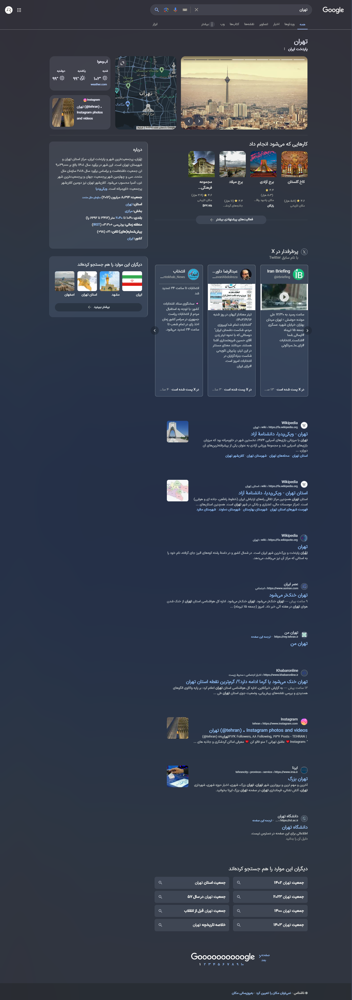
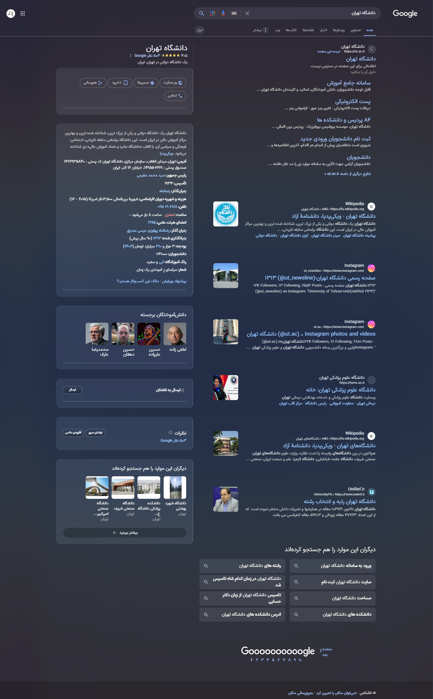
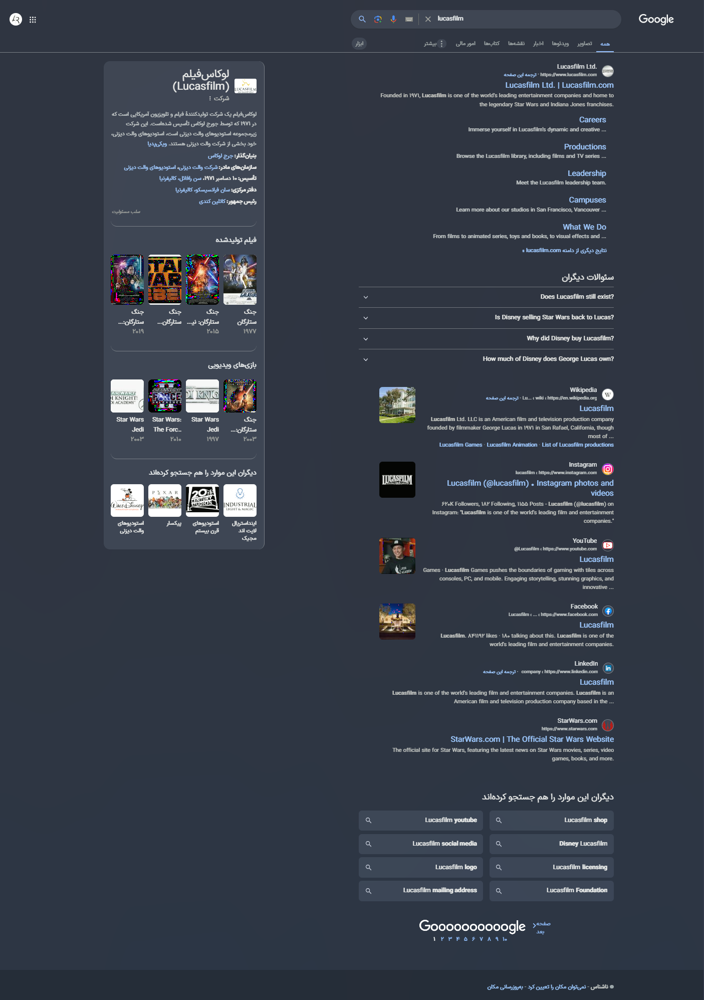

    <h2>
        Nord-Theme for Google
    </h2>
    

        🔵 Modernizing Google pages with the Nord color palette... 🔵
    

 

## Features

- Colorizing with Nord palette
- Built for RTL languages and pages
- Remove annoying sections for cleaner screen
- Remove extra parameters from search URLs
- Not based on class names

## How to use
1. Install any userscript manager extension like [Tampermonkey](https://chromewebstore.google.com/detail/nbhcbdghjpllgmfilhnhkllmkecfmpld) / [Violentmonkey](https://chromewebstore.google.com/detail/violentmonkey/jinjaccalgkegednnccohejagnlnfdag) or [Greasemonkey](https://addons.mozilla.org/en-US/firefox/addon/greasemonkey)
2. Open <a href="https://github.com/amoAR/Nord-Google-V2/raw/main/Nord_Google.user.js" target="_blank">This</a> link & install! :tada:

##### To work on the search results page, you must give the _`Allow access to search page results`_ permission for extension.

## Screenshots

<table>
    <tbody>
        <tr>
            <td colspan=2 align="center">
                
            </td>
        </tr>
        <tr>
            <td align="center">
                
            </td>
            <td align="center">
                
            </td>
        </tr>
    </tbody>
</table>

> Preview image shows with [GX Vibes Shader](https://store.gx.me/mods/cyyg3i/vibes-shader/), [IRANSansX](https://fontiran.com/fonts/iransans) font on [OperaGX](https://www.opera.com/gx).